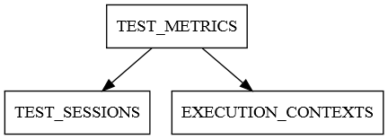

===================
Exploiting measures
===================

Storage
-------

Once measures are collected, `pytest-monitor` dumps them either in a local database
or sends them to a monitor server.

In the case of local storage, a `sqlite3` database is used, as it is lightweight and
is provided with many Python distributions (being part of the standard library).

Measures are stored in the `pytest` invocation directory, in a database file named **.pymon**.
You are free to override the name of this database by setting the `--db` option:

.. code-block:: shell

    pytest --db /path/to/your/monitor/database

You can also sends your tests result to a monitor server (under development at that time) in order to centralize
your Metrics and Execution Context (see below):

.. code-block:: shell

    pytest --remote server:port

Execution Context, Metrics and Session
--------------------------------------

We distinguish two kinds of measures:

    - those related to the **Execution Context**. This is related to your machine (node name, CPU, memory…),
    - the **Metrics** related to the tests themselves (this can be the memory used, the CPU usage…).

Regarding tests related **metrics**, one can see metrics which are tests independent and those which
are session independent (session start date, scm reference). For this reason, `pytest-monitor` uses
a notion of session metrics to which each tests are linked to.

Additionally, each test is linked to an Execution Context so that comparisons between runs is possible.

Model
-----

The local database associates each test Metrics to the specific context in which it was run:

Execution Context
~~~~~~~~~~~~~~~~~

Execution Contexts are computed prior to the start of the `pytest`
session. An Execution Context describes much of the machine settings:

CPU_COUNT (integer)
    Number of online CPUs the machine can use.
CPU_FREQUENCY_MHZ (integer)
    Base frequency of the CPUs (in megahertz).
CPU_VENDOR (TEXT 256 CHAR)
    Full CPU vendor string.
RAM_TOTAL_MB (INTEGER)
    Total usable RAM (physical memory) in megabytes.
MACHINE_NODE (TEXT 512 CHAR)
    Fully qualified domain name of the machine.
MACHINE_TYPE (TEXT 32 CHAR)
    Machine type.
MACHINE_ARCH (TEXT 16 CHAR)
    Mode used (64 bits…).
SYSTEM_INFO (TEXT 256 CHAR)
    Operating system name and release level.
PYTHON_INFO (TEXT 512 CHAR)
    Python information (version, compilation mode used and so on…)
ENV_H (TEXT 64 CHAR)
    Hash string used to uniquely identify an execution context.

In the local database, Execution Contexts are stored in table `EXECUTION_CONTEXTS`.

Sessions
--------
SESSION_H (TEXT 64 CHAR)
    Hash string used to uniquely identify a session run.
RUN_DATE (TEXT 64 CHAR)
    Time at which the `pytest` session was started. The full format is
    'YYYY-MM-DDTHH:MM:SS.uuuuuu' (ISO 8601 format with UTC time). The fractional second part is omitted if it is zero.
SCM_ID (TEXT 128 CHAR)
    Full reference to the source code management system if any.
RUN_DESCRIPTION (TEXT 1024 CHAR)
    A free text field that you can use to describe a session run.

In the local database, Sessions are stored under the table `TEST_SESSIONS`.

Metrics
~~~~~~~

Metrics are collected at test, class and/or module level. For both classes and modules, some of the
metrics can be skewed due to the technical limitations described earlier. 

SESSION_H (TEXT 64 CHAR)
    Session context used for this test.
ENV_H (TEXT 64 CHAR)
    Execution Context used for this test.
ITEM_START_TIME (TEXT 64 CHAR)
    Time at which the item test was launched. The full format is
    'YYYY-MM-DDTHH:MM:SS.uuuuuu' (ISO 8601 format with UTC time). The fractional second part is omitted if it is zero.
ITEM_PATH (TEXT 4096 CHAR)
    Path of the item, using an import compatible string specification.
ITEM (TEXT 2096 CHAR)
    Initial item name, without any variant.
ITEM_VARIANT varchar(2048)
    Full item name, with parametrization used if any.
ITEM_FS_LOC varchar(2048)
    Item's module path relative to pytest invocation directory.
KIND (TEXT 64 CHAR)
    Type of item (function, class, module…).
COMPONENT (TEXT 512 CHAR), NULLABLE
    Component to which the test belongs, if any (this is used when sending results to a server, for identifying each source of Metrics).
TOTAL_TIME (FLOAT)
    Total time spent running the item (in seconds).
USER_TIME (FLOAT)
    Time spent in User mode (in seconds).
KERNEL_TIME (FLOAT)
    Time spent in Kernel mode (in seconds).
CPU_USAGE (FLOAT)
    System-wide CPU usage as a percentage (100 % is equivalent to one core).
MEM_USAGE (FLOAT)
    Maximum resident memory used during the test execution (in megabytes).

In the local database, these Metrics are stored in table `TEST_METRICS`.
